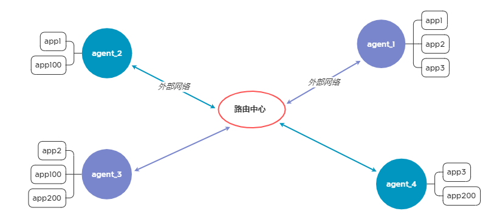

# All talking platform #
# 双向TCP代理平台 #

## 综述 ##
 本项目实现了一个网络环路平台，支持任意接入的两个节点之间相互代理，实现局域网内互通。

## 功能简介 ##
### 功能图 ###

路由中心部署在外部可访问网络中，作为多方接入平台；
代理节点部署在用户侧局域网中，作为通信单元。
代理节点通过<uid, password>完成认证。
需要通信的两个代理点，主动方可向被动方发起TCP连接任务，最终由被动方启动指定连接，实现跨网代理。

### 项目特点 ###
 * 通信与业务分离，底层通信采用sock_api高性能库,简化业务逻辑。
 * 纯粹的TCP代理，通过路由中心实现局域网互联，对内部app完全不感知网络迁移。
 * 认证和加密仅在代理和平台之间两两进行，避免多方泄密问题。
 * 通过驱使对向节点发起指定的TCP连接，跨网远程完全透明。
 * 底层框架sock_api是本人开发专用于TCP通信，架构设计先进，性能优异。
 * 程序所有功能完全基于底层api自主实现，不依赖于任何系统及外部工具，简洁高效。
### 使用场景示例 ###
 * 个人对ssh，远程协助mstsc，以及网站https的代理测试有效。
## 结束语 ##
 ** Let communication easy. **
